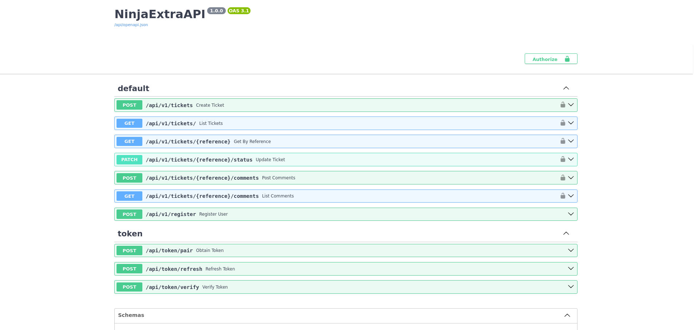

# HELP DESK API



> README criado para explicar, passo a passo, cada rota, fluxo de autenticação, regras de negócio e como usar a API de suporte/ticket do projeto.

## Índice

1. Visão geral
2. Estrutura do projeto
3. Como executar o projeto
4. Fluxo de autenticação e login
5. Endpoints de JWT e rotas de token
6. Rotas da API de tickets
7. Rotas de comentários de tickets
8. Regras de acesso e permissões
9. Modelos e campos principais
10. Observações extras

---

## 1. Visão geral

Esta API é uma aplicação Django + Django Ninja projetada para gerenciar tickets de suporte. O objetivo é receber chamados, acompanhar seu estado, registrar comentários e controlar acesso por usuário autenticado.

O projeto inclui:

- registro de usuários
- autenticação com JWT
- criação e listagem de tickets
- alteração de status de ticket
- comentários em tickets
- permissões baseadas em grupos de usuário

## 2. Estrutura do projeto

Principais arquivos e pastas:

- `manage.py`: comando principal do Django para rodar servidor, migrar banco e gerir o projeto.
- `core/`: configuração do projeto Django.
  - `core/settings.py`: configurações do Django, banco de dados, apps e JWT.
  - `core/urls.py`: rotas principais do Django.
- `ticket/`: app de tickets.
  - `ticket/api.py`: define o `NinjaExtraAPI`, registra o controlador JWT e adiciona o router da app.
  - `ticket/urls.py`: aponta a rota principal da app para o Ninja.
  - `ticket/controllers/user_controller.py`: define endpoints de ticket e registro de usuário.
  - `ticket/services/user_service.py`: implementa regras de negócio de tickets, comentários e registro.
  - `ticket/shemas/user_shemas.py`: schemas de entrada e saída para validação dos payloads.
  - `ticket/models.py`: modelos `Ticket` e `TicketComment`.
  - `ticket/utils/permissions.py`: define a função que retorna o papel do usuário.

## 3. Como executar o projeto

1. Instalar dependências:

   ```bash
   python3 -m venv venv
   source venv/bin/activate
   pip install -r requiriments.txt
   ```

2. Configurar variáveis de ambiente no `.env` ou no ambiente de execução:
   - `POSTGRES_DB`
   - `POSTGRES_USER`
   - `POSTGRES_PASSWORD`
   - `HOST`
   - `PORT`

3. Rodar as migrations:

   ```bash
   python manage.py migrate
   ```

4. Iniciar o servidor de desenvolvimento:

   ```bash
   python manage.py runserver
   ```

5. Acessar a documentação interativa (Swagger):
   - `http://localhost:8000/api/docs`

6. A API base está exposta em:
   - `http://localhost:8000/api/`

## 4. Fluxo de autenticação e login

A API utiliza JWT através do `django-ninja-jwt`. O fluxo principal é:

1. O usuário se registra em `POST /api/v1/register`.
2. O usuário faz login em `POST /api/token/pair` com `username` e `password`.
3. A API retorna um par de tokens: `access` e `refresh`.
4. A cada requisição protegida, o cliente envia o token de acesso no cabeçalho `Authorization`.
5. Quando o token de acesso expira, o cliente solicita um novo token em `POST /api/token/refresh` usando o token `refresh`.
6. Existe também um endpoint de verificação de token em `POST /api/token/verify`.

### Formato do cabeçalho de autenticação

Para rotas protegidas, envie:

```http
Authorization: Bearer <ACCESS_TOKEN>
```

### Tempo de vida dos tokens

Nas configurações (`core/settings.py`):

- `ACCESS_TOKEN_LIFETIME`: 60 minutos
- `REFRESH_TOKEN_LIFETIME`: 7 dias
- `AUTH_HEADER_TYPES`: `Bearer`

## 5. Endpoints de JWT e rotas de token

A API expõe os endpoints JWT sob `/api/token`:

- `POST /api/token/pair`
  - Payload:
    - `username`: string
    - `password`: string
  - Retorno:
    - `access`: token JWT de acesso
    - `refresh`: token JWT de refresh

- `POST /api/token/refresh`
  - Payload:
    - `refresh`: string
  - Retorno:
    - `access`: novo token JWT de acesso

- `POST /api/token/verify`
  - Payload:
    - `token`: string
  - Retorno:
    - validação do token (normalmente o payload do token)

Essas rotas são registradas pelo controlador `NinjaJWTDefaultController` em `ticket/api.py`.

## 6. Rotas da API de tickets

Todos os endpoints de tickets estão sob `/api/v1/` e exigem autenticação JWT.

### `POST /api/v1/register`

- Descrição: registra um novo usuário.
- Payload:
  - `username`: string
  - `email`: string
  - `password`: string
- Retorno:
  - `id`, `username`, `email`
- Observação: este endpoint não exige token.

### `POST /api/v1/tickets`

- Descrição: cria um novo ticket.
- Requer autenticação.
- Payload:
  - `title`: string
  - `description`: string
- Comportamento interno:
  - `status` é definido como `open`.
  - `priority` é definido como `MEDIUM` por padrão.
  - Se o título contiver palavras como `erro`, `falha`, `bug`, `crítico`, `indisponível`, `não funciona`, `logar`, a prioridade sobe para `HIGH`.
  - `reference` é gerado automaticamente no formato `TCKT-YYYYMMDDHHMM:SS-xxxx`.
  - O campo `user` é associado ao usuário que fez a requisição.
- Retorno: todas as informações do ticket.

### `GET /api/v1/tickets/`

- Descrição: lista tickets.
- Requer autenticação.
- Filtros opcionais por query params:
  - `status`: filtra por `open`, `in_progress`, `closed`
  - `search`: busca em `title` e `description`
  - `priority`: filtra por `LOW`, `MEDIUM`, `HIGH`
- Comportamento de permissão:
  - `admin` ou `support` veem todos os tickets.
  - usuários comuns veem apenas seus próprios tickets.
- Resultado paginado pelo Ninja.

### `GET /api/v1/tickets/{reference}`

- Descrição: busca um ticket pelo seu `reference`.
- Requer autenticação.
- Permissão:
  - `admin` ou `support` podem acessar qualquer ticket.
  - usuário comum só pode acessar ticket associado a ele.
- Retorno: dados completos do ticket.

### `PATCH /api/v1/tickets/{reference}/status`

- Descrição: atualiza o status de um ticket.
- Requer autenticação.
- Payload:
  - `status`: um dos valores do `Ticket.Status` (`open`, `in_progress`, `closed`).
- Permissão:
  - somente usuários em grupo `admin` ou `support` podem alterar o status.
- Retorno: o ticket atualizado.

## 7. Rotas de comentários de tickets

### `POST /api/v1/tickets/{reference}/comments`

- Descrição: adiciona um comentário a um ticket.
- Requer autenticação.
- Payload:
  - `message`: string
- Permissão:
  - `admin` ou `support` podem comentar qualquer ticket.
  - o usuário dono do ticket também pode comentar.
- O campo `author` do comentário é preenchido com `request.user.username`.
- Retorno: dados do comentário criado.

### `GET /api/v1/tickets/{reference}/comments`

- Descrição: lista comentários de um ticket.
- Requer autenticação.
- Permissão:
  - `admin` ou `support` veem todos os comentários.
  - o dono do ticket vê seus comentários.
- Retorno: lista de comentários ordenada por `created_at` decrescente.

## 8. Regras de acesso e permissões

O comportamento de permissão é controlado por grupos de usuário:

- Grupo `admin`
- Grupo `support`
- Usuário sem grupo: `user`

### Permissões gerais

- Visualizar e listar tickets:
  - `admin` e `support`: todos os tickets
  - `user`: apenas tickets próprios
- Ver detalhes de ticket:
  - `admin` e `support`: qualquer ticket
  - `user`: apenas ticket próprio
- Atualizar status de ticket:
  - apenas `admin` e `support`
- Criar ticket:
  - qualquer usuário autenticado
- Criar comentário:
  - dono do ticket
  - `admin` ou `support`
- Listar comentários:
  - dono do ticket
  - `admin` ou `support`

## 9. Modelos e campos principais

### Ticket

Campos principais de `Ticket`:

- `reference`: string única e indexada usada como identificador público.
- `user`: relacionamento com `django.contrib.auth.models.User`.
- `email`: email do solicitante.
- `title`: título do ticket.
- `description`: descrição detalhada do problema.
- `status`: `open`, `in_progress` ou `closed`.
- `priority`: `LOW`, `MEDIUM`, `HIGH`.
- `created_at`: data de criação.
- `updated_at`: data da última atualização.

### TicketComment

Campos principais de `TicketComment`:

- `ticket`: relação com o ticket.
- `author`: nome do usuário que comentou.
- `message`: texto do comentário.
- `created_at`: data de criação.

## 10. Observações extras

- A documentação automática do Ninja está disponível em `http://localhost:8000/api/docs`.
- O OpenAPI JSON padrão está em `http://localhost:8000/api/openapi.json`.
- O endpoint de registro não exige `Authorization`, mas todos os demais endpoints de tickets exigem o token JWT.
- O fluxo recomendado é:
  1. registrar usuário
  2. obter token em `/api/token/pair`
  3. usar token em `Authorization: Bearer <access>` nas chamadas
  4. renovar token com `/api/token/refresh` quando necessário

---

## Autor

- Benilson Benito

## Contato

- Projeto criado em Django Ninja com JWT e arquitetura de serviço para tickets de suporte.
